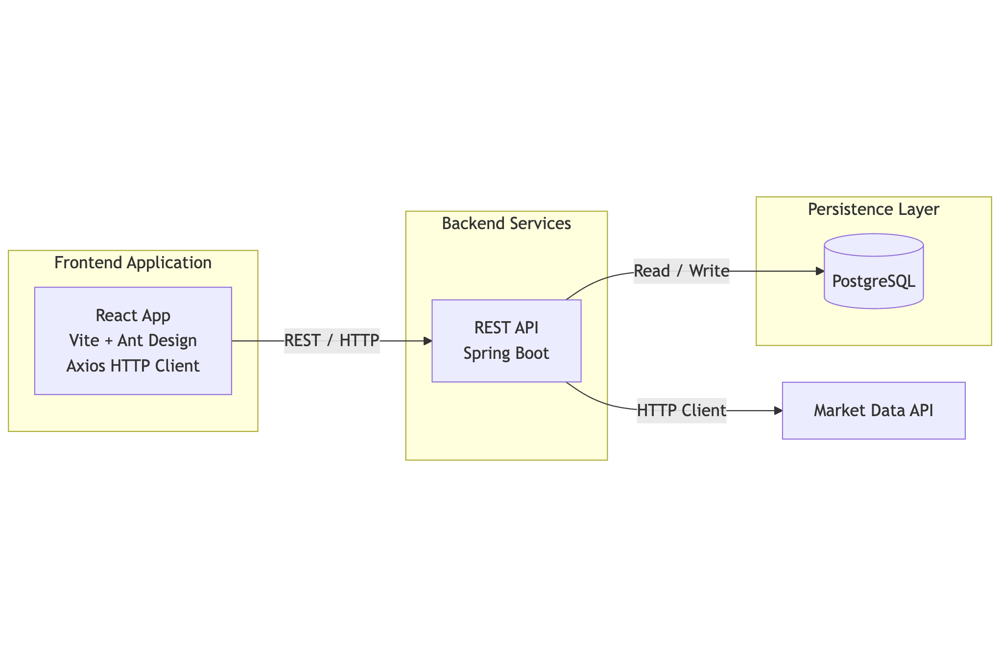

# Trading Platform Frontend

A React-based frontend application that consumes REST APIs exposed by a Spring Boot trading backend.
## Project Overview

This project implements the frontend portion of a trading platform. It is built on top of an existing Spring Boot backend and focuses on presenting trading-related data and enabling basic user interactions through REST APIs.

The application is developed as a Minimum Viable Product (MVP), with emphasis on correctness, clarity, and maintainable structure rather than visual complexity.

## Scope & Features

The frontend application allows users to:

- View a list of all traders
- View a daily list of market quotes
- View details of a specific trader

Users can also perform the following actions:

- Create a new trader
- Create a new quote
- Deposit funds into a trader’s account
- Withdraw funds from a trader’s account

All operations are performed by communicating with backend REST APIs.

## Technology Stack

### Frontend
- React
- JavaScript (ES6+)
- Ant Design (UI components and form handling)
- Axios (HTTP client)
- Vite (development and build tool)

### Backend (Provided)
- Spring Boot REST API
- PostgreSQL
- Docker

## Architecture Overview

The application follows a typical frontend–backend separation model.

- The frontend is responsible for UI rendering, navigation, and client-side validation.
- The backend handles business logic, data persistence, and external market data integration.
- Communication between frontend and backend is done exclusively through HTTP-based REST APIs.
## System Architecture

## Frontend Structure

The frontend is organized around page-level components, each responsible for a specific domain:

- **Dashboard Page**  
  Displays all traders and provides the ability to create new traders.

- **Quotes Page**  
  Displays a daily list of market quotes.

- **Trader Account Page**  
  Displays account details for a specific trader and allows fund deposit and withdrawal.

Shared UI elements such as navigation and reusable components are extracted to improve maintainability.

## Input Validation

Client-side input validation is implemented using Ant Design form validation rules.

Validation is applied to:
- Trader creation forms (required fields, email format)
- Deposit and withdrawal inputs (numeric values greater than zero)

The goal of frontend validation is to prevent invalid input from being submitted to the backend and to provide immediate feedback to users. Backend-side validation is still expected and treated as the final authority.

## Testing

This project focuses primarily on functional correctness and manual validation during development.

Unit testing is encouraged but not heavily emphasized at this stage, as the primary goal is to deliver a working MVP that integrates correctly with the provided backend service.

## Deployment & DevOps

- Source code is managed using Git and GitHub.
- The application is designed to run locally during development using Vite.
- Containerization is supported via Docker for consistency across environments.
